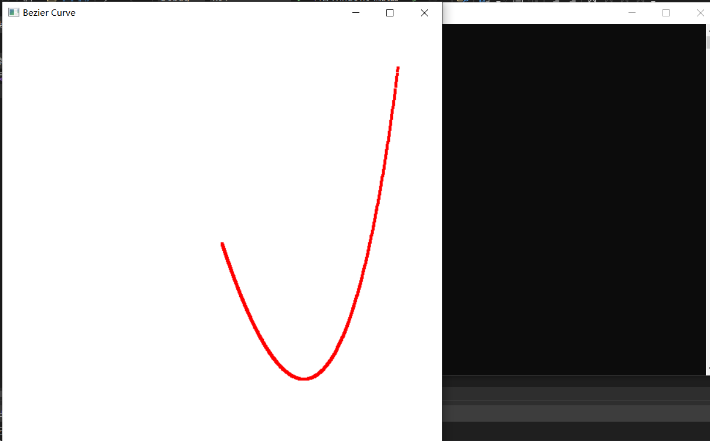

1. 本次实验任务是生成曲面或者曲线，文件exp14通过代码实现了Bezier算法生成曲线样条的功能，关键代码如下：

   ```C++
   void bezier(wcPt3D *ctrlPts, GLint nCtrlPts, GLint nBezPts)
   {
       GLint *C, k;
       GLfloat u;
       wcPt3D bezPt;
       C = new GLint[nCtrlPts];
       binomialCoeffs(nCtrlPts - 1, C);
       for (k = 0; k <= nBezPts; k++)
       {
           u = GLfloat(k) / GLfloat(nBezPts);
           computeBezPt(u, &bezPt, nCtrlPts, ctrlPts, C);
           plotPoint(bezPt);
       }
       delete[] C;
   }
   ```

2. 程序运行结果为：

   

3. 实验总结：

   通过本次实验，我理解了Bezier算法生成曲线的过程，同时也加深了对相关数学理论的理解，对一些数学函数的使用再次加深了印象，并通过代码将画曲线的功能实现了，