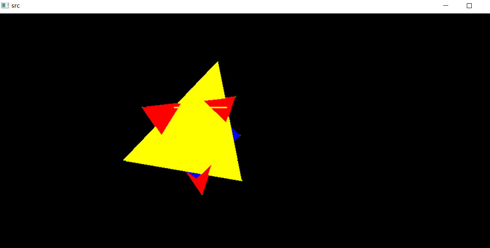

1. 本次实验任务是完成消隐实验，文件exp15通过python代码实现了Z-buffer算法，实现了消隐的功能；程序的使用：通过鼠标在屏幕上点击多边形的顶点构建多边形，然后通过键盘按下字母e为多边形定形，之后可以通过键盘r，g，b三个字母中选择一个来作颜色填充，r是红色，g是绿色，b是蓝色，可以重复进行上述操作，填充多个多边形，若要退出程序使用键盘是上的q，不能通过×来关闭窗口。

2. 程序结果图：

   

3. 实验总结：

   Z-buffer算法思想是建立两个缓冲器：

   * 深度缓存器：用以存储图像空间的每一像素相应的深度值，初始化为最大深度值（Zs坐标）；
   * 帧缓冲器：用以存储图像空间中的每个像素的颜色，初始化为屏幕的背景色。

   算法步骤为：

   1. 将帧缓冲器初始值置为背景色；
   2. 确定深度缓冲器的宽度、高度和初始深度，一般将初始深度置为最大深度值；
   3. 对于多边形表面中的每一像素（xs，ys），计算其深度值zs（xs，ys）；
   4. 将zs（xs，ys）与存储在z缓冲器中该位置的深度值zBuffer（xs，ys）进行比较；
   5. 如果zs（xs，ys）重置zBuffer（xs，ys）。