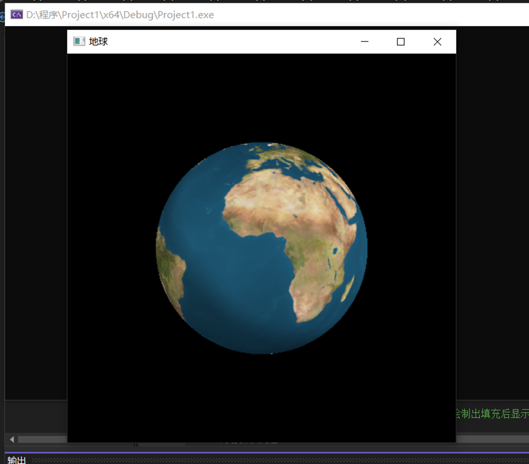
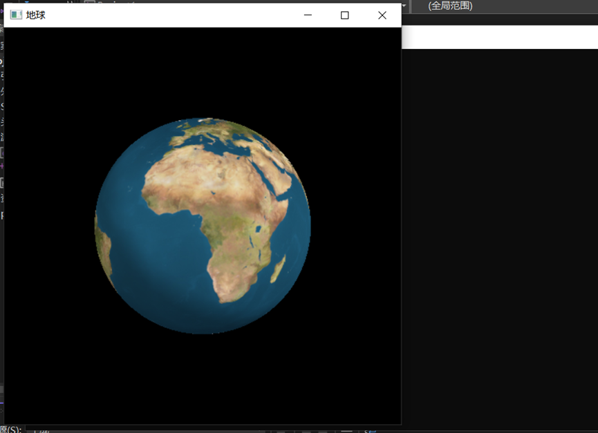
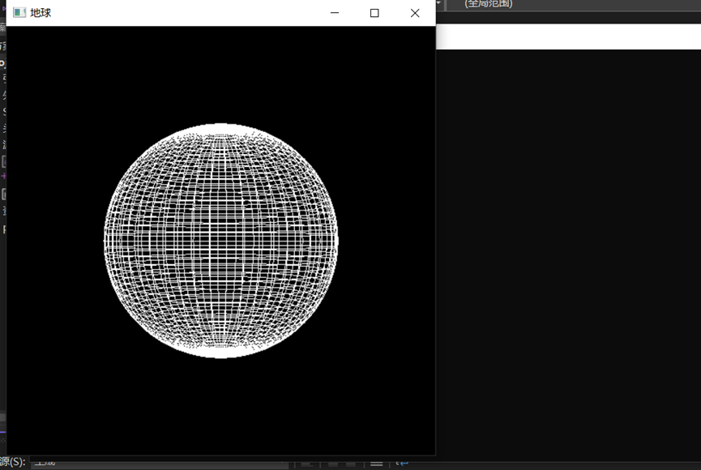
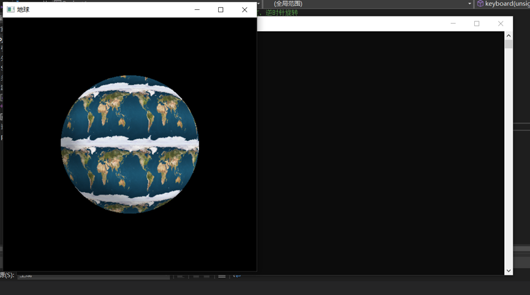

1. 本次实验是期末综合实验，通过代码实现了纹理贴图和光照的效果，能够通过键盘上的R、Z、F、L键控制图形的相关显示，其中R是使地球顺时针旋转10度，Z是使地球逆时针旋转10度，L是出现地球线框图，F是出现填充纹理图。

2. 运行结果图是：

   

   顺时针旋转10度后结果为

   

   线框图为：

   

   填充图为：

   

3. 实验总结：

   本次实验我完成了一个通过纹理贴图实现的地球，通过键盘上的R,Z,L,F四个按键可以对地球进行操作，注意是大写状态，其中R是使地球顺时针旋转10度，Z是使地球逆时针旋转10度，L是出现地球线框图，F是出现填充纹理图。本次实验是一个比较综合的实验，将我们本学期学到的很多知识都结合在了一起，例如纹理贴图、光照、线框图、键盘交互等等知识点，和之前实验有明显的区别，之前的实验是完成单个知识点即可，这次的复合了许多知识点，在实验过程中我也遇到了很多问题，程序不是报错就是一直出bug，这也让我深刻的意识到图形学中的很多知识点并不是独立分开的，很多知识点都是有机的串联在一起，我们要有总体的知识框架，弄清楚我们要干什么，要用到哪些知识点，OpenGL中的哪些函数可以帮助我们实现我们想要的功能，将这些弄清楚之后我们来写程序就很顺畅，也能在我们实现基础功能后，我们能在这些基础功能上添加一些更复杂的功能。本次实验另一个深刻体会是遇到问题也不要担心，毕竟人生总是在经历各种磨难，这些磨难也是在我们变得越来越强。此次我在网上看了很多人写的博客以及一些相关书籍，才将我的问题逐一化解，让我受益匪浅，我也领悟到OpenGL以及计算机图形学相关知识领域的魅力，以后想继续深入相关领域学习更广的知识，将来也想在图形学相关领域有着更高的造诣。